# Experiment — what block labels can do

Empirical tests of mermaid `block` label formatting, because **the official syntax page documents
none of it.** Searched the Mermaid 11.16.1 *Block Diagram Syntax* page for `markdown`, `<br`,
`newline`, `multiline`, `line break`, `backtick` — **zero hits.** It covers `columns`, widths,
shapes, edges, `style` and `classDef`, and stops there.

So these are the questions, and the only way to answer them is to render and look.

> **Syntax note:** the keyword is **`block`**, not `block-beta`. The beta suffix is gone as of
> 11.16.1. Everything in `README.md` was written against the old form and needs updating if the
> old form has stopped working — test A0 checks exactly that.

**How to use this page:** open it on GitHub, then note which tests render as intended. Anything
that fails will usually show as literal characters in the box, or break the whole diagram.

### Findings so far

**❌ Markdown strings are not supported in `block` — at all.** A3 fails with:

```
Parse error on line 3:
... columns 1 a3["`line oneline two`"]
---------------------^
Expecting 'STR', got 'MD_STR'
```

That error is more useful than a plain failure. `MD_STR` is a real token, so the **lexer**
recognises backtick markdown strings — but the `block` **grammar** only accepts `STR`. The feature
exists in Mermaid and was never wired into block diagrams.

**Consequence: every backtick test will fail the same way** — B2, C1, C3, D1 and E2 are all
predicted ❌ without needing separate diagnosis. Worth confirming one of them, then skipping the
rest. It also means **HTML is the only formatting route available**, which decides groups B–E in
advance and makes group H below the open question.

**✅ `block-beta` still parses** (A0), so `README.md` is not broken — it wants renaming, not
migrating.

---

## A0 · Does the old keyword still work?

If this renders, `block-beta` is still accepted as an alias and `README.md` is safe. If it shows
as source, `README.md` needs a sweep.

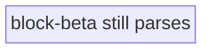

---

## A · Line breaks

### A1 · `<br/>`

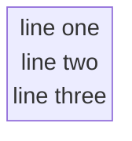

### A2 · `<br>` unclosed

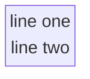

### A3 · Markdown string — backtick-quoted, real newlines

❌ **Confirmed failure.** `Expecting 'STR', got 'MD_STR'` — see *Findings so far*. Left in place
deliberately as the evidence; the broken render below is the point.

```mermaid
block
  columns 1
  a3["`line one
line two`"]
```

### A4 · Literal `\n`


---

## B · Bold

### B1 · Markdown `**` inside a plain quoted string

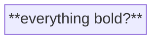

### B2 · Markdown `**` inside a backtick markdown string

```mermaid
block
  columns 1
  b2["`**everything bold?**`"]
```

### B3 · HTML `<b>`

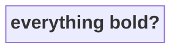

### B4 · HTML `<strong>`


---

## C · Partial bold — the one that matters

If only whole-label bold works, the label design has to change.

### C1 · Markdown, partial, backtick string

```mermaid
block
  columns 1
  c1["`**MailFrom** is bold, this is not`"]
```

### C2 · HTML, partial

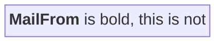

### C3 · Italic and code, partial

```mermaid
block
  columns 1
  c3["`*italic* and normal and **bold**`"]
```

---

## D · Combined — bold plus multiline

The real target: a slice label with a bold title and plain detail beneath.

### D1 · Backtick markdown, newline + bold

```mermaid
block
  columns 1
  d1["`**MailFrom**
reverse_path`"]
```

### D2 · HTML both ways

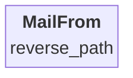

### D3 · Three lines, bold first

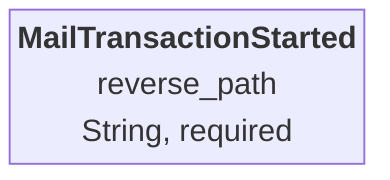

---

## E · A real Command Slice, both ways

Whichever of these looks right wins.

### E1 · HTML labels

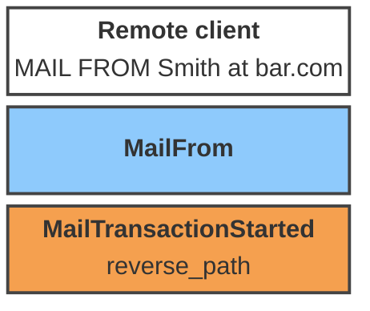

### E2 · Markdown labels

```mermaid
block
  columns 1
  e2a["`**Remote client**
MAIL FROM Smith at bar.com`"]
  e2b["`**MailFrom**`"]
  e2c["`**MailTransactionStarted**
reverse_path`"]

  classDef screen fill:#ffffff,stroke:#444,stroke-width:2px,color:#000
  classDef command fill:#8ecafc,stroke:#444,stroke-width:2px,color:#000
  classDef event fill:#f5a04f,stroke:#444,stroke-width:2px,color:#000
  class e2a screen
  class e2b command
  class e2c event
```

---

## F · Forced width

Long labels may wrap on their own. `columns` plus a spanning block is the documented width lever.

### F1 · Long label, natural wrap

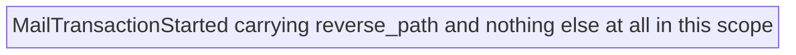

### F2 · Width forced by a wide neighbour

`f2b:3` spans three columns, setting the row width.

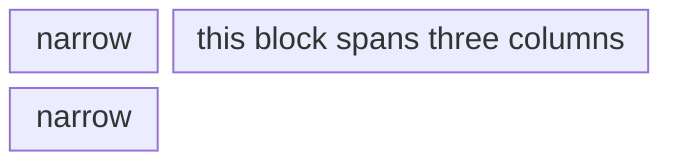

---

## G · Shapes as a color-independent encoding

If color ever fails — printing, color-blind readers, a viewer that strips `classDef` — shape
can carry the element type instead.

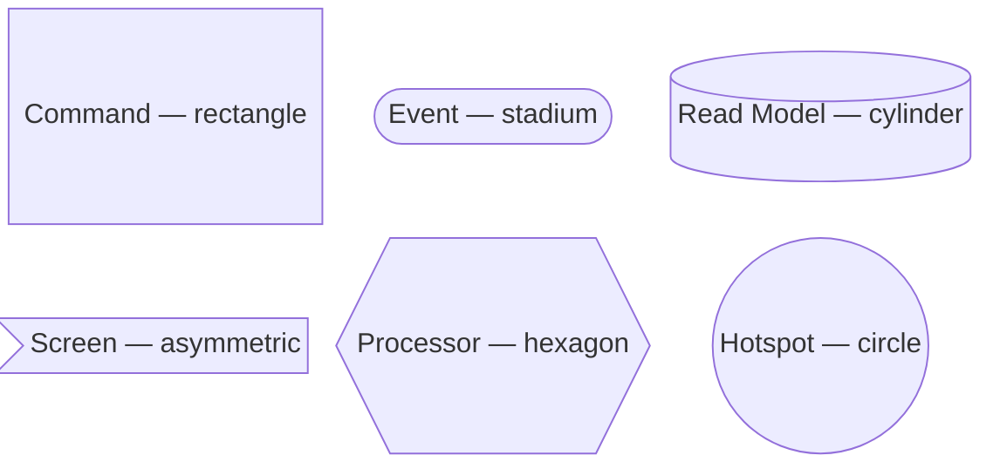

---

## H · Text justification

**The open question**, now that markdown strings are ruled out and HTML is the only route.

Mermaid centres label text by default. A slice label with a bold title over a field list reads far
better left-aligned, so: can it be forced?

### H1 · `text-align` via `style`

Does the node style reach the text, or only the shape?

```mermaid
block
  columns 1
  h1["<b>MailTransactionStarted</b><br/>reverse_path<br/>received_at"]
  style h1 fill:#f5a04f,stroke:#444,stroke-width:2px,color:#000,text-align:left
```

### H2 · `<div align="left">`

```mermaid
block
  columns 1
  h2["<div align='left'><b>MailTransactionStarted</b><br/>reverse_path<br/>received_at</div>"]
  style h2 fill:#f5a04f,stroke:#444,stroke-width:2px,color:#000
```

### H3 · `<div style="text-align:left">`

```mermaid
block
  columns 1
  h3["<div style='text-align:left'><b>MailTransactionStarted</b><br/>reverse_path<br/>received_at</div>"]
  style h3 fill:#f5a04f,stroke:#444,stroke-width:2px,color:#000
```

### H4 · `text-align` via `classDef`

If `style` fails, `classDef` may inject differently.

```mermaid
block
  columns 1
  h4["<b>MailTransactionStarted</b><br/>reverse_path<br/>received_at"]
  classDef leftish fill:#f5a04f,stroke:#444,stroke-width:2px,color:#000,text-align:left
  class h4 leftish
```

### H5 · `<span>` with inline style

Tests whether *any* nested HTML element survives, not just `<b>` and `<br/>`.

```mermaid
block
  columns 1
  h5["<span style='text-align:left;display:block'><b>MailTransactionStarted</b><br/>reverse_path</span>"]
  style h5 fill:#f5a04f,stroke:#444,stroke-width:2px,color:#000
```

### H6 · Padding hack — `&nbsp;`

Works regardless of alignment support: pad the short lines so centring lands them flush left.
Ugly, but it always works if the entities render.

```mermaid
block
  columns 1
  h6["<b>MailTransactionStarted</b><br/>reverse_path&nbsp;&nbsp;&nbsp;&nbsp;&nbsp;&nbsp;&nbsp;&nbsp;&nbsp;<br/>received_at&nbsp;&nbsp;&nbsp;&nbsp;&nbsp;&nbsp;&nbsp;&nbsp;&nbsp;&nbsp;"]
  style h6 fill:#f5a04f,stroke:#444,stroke-width:2px,color:#000
```

### H7 · Leading spaces

Cheapest possible attempt — does the label preserve leading whitespace?

```mermaid
block
  columns 1
  h7["<b>MailTransactionStarted</b><br/>    reverse_path<br/>    received_at"]
  style h7 fill:#f5a04f,stroke:#444,stroke-width:2px,color:#000
```

---

## Results

Fill in as observed. This table is the deliverable — `README.md` gets rebuilt from whatever wins.

| Test | What it checks | Renders? | Notes |
|:---:|---|:---:|---|
| A0 | `block-beta` still parses | ✅ | Old keyword still accepted — `README.md` wants renaming, not migrating |
| A1 | `<br/>` | ✅ | |
| A2 | `<br>` unclosed | | |
| A3 | markdown string newline | ❌ | `Parse error … Expecting 'STR', got 'MD_STR'` — markdown strings are not in the `block` grammar |
| A4 | literal `\n` | | |
| B1 | `**` plain string | | |
| B2 | `**` markdown string | | predicted ❌ — same `MD_STR` cause as A3 |
| B3 | `<b>` | | |
| B4 | `<strong>` | | |
| C1 | partial bold, markdown | | predicted ❌ — same `MD_STR` cause as A3 |
| C2 | **partial bold, HTML** | | the decisive one |
| C3 | italic + bold mixed | | predicted ❌ — same `MD_STR` cause as A3 |
| D1 | bold + newline, markdown | | predicted ❌ — same `MD_STR` cause as A3 |
| D2 | bold + newline, HTML | | |
| D3 | three lines | | |
| E1 | real slice, HTML | | |
| E2 | real slice, markdown | | predicted ❌ — same `MD_STR` cause as A3 |
| F1 | natural wrap | | |
| F2 | forced width via span | | |
| G | shapes | | |
| H1 | `text-align` via `style` | | |
| H2 | `<div align='left'>` | | |
| H3 | `<div style='text-align:left'>` | | |
| H4 | `text-align` via `classDef` | | |
| H5 | `<span>` inline style | | tests whether nested HTML survives at all |
| H6 | `&nbsp;` padding hack | | always works if entities render |
| H7 | leading spaces | | |
