# Experiment — what block labels can do

Empirical tests of mermaid `block` label formatting, because **the official syntax page documents
none of it.** Searched the Mermaid 11.16.1 *Block Diagram Syntax* page for `markdown`, `<br`,
`newline`, `multiline`, `line break`, `backtick` — **zero hits.** It covers `columns`, widths,
shapes, edges, `style` and `classDef`, and stops there.

So these are the questions, and the only way to answer them is to render and look.

> **Syntax note:** the keyword is **`block`**, not `block-beta`. The beta suffix is gone as of
> 11.16.1. Everything in `README.md` was written against the old form and needs updating if the
> old form has stopped working — test A0 checks exactly that.

**How to use this page:** open it on GitHub, then note which tests render as intended. Anything
that fails will usually show as literal characters in the box, or break the whole diagram.

### Findings so far

**❌ Markdown strings are not supported in `block` — at all.** A3 fails with:

```
Parse error on line 3:
... columns 1 a3["`line oneline two`"]
---------------------^
Expecting 'STR', got 'MD_STR'
```

That error is more useful than a plain failure. `MD_STR` is a real token, so the **lexer**
recognises backtick markdown strings — but the `block` **grammar** only accepts `STR`. The feature
exists in Mermaid and was never wired into block diagrams. Markdown strings *do* work in
`flowchart`, where they give partial bold and multi-line labels from one construct.

📌 **Parked for investigation** — is this a deliberate limitation or an omission in the block
grammar? Worth reading `block.jison` against the flowchart grammar, and checking the issue tracker
before filing. Recorded as **D3** in
[`../research/UPSTREAM-DEFECTS.md`](../research/UPSTREAM-DEFECTS.md). If it is fixed upstream,
group H below becomes unnecessary.

**Consequence: every backtick test will fail the same way** — B2, C1, C3, D1 and E2 are all
predicted ❌ without needing separate diagnosis. Worth confirming one of them, then skipping the
rest. It also means **HTML is the only formatting route available**, which decides groups B–E in
advance and makes group H below the open question.

**✅ `block-beta` still parses** (A0), so `README.md` is not broken — it wants renaming, not
migrating.

**✅ HTML works, and partial bold works.** `<b>` and `<strong>` both render (B3, B4), and **C2 —
the decisive test — passes**: `<b>MailFrom</b> is bold, this is not` bolds only the tagged span.
A bold title over plain detail is therefore achievable, which was the open question behind the
whole label design.

**✅ Literal `\n` works for line breaks** (A4), alongside `<br/>` (A1). Worth preferring where a
label needs no other markup — it keeps the source readable.

**❌ Markdown is not parsed in plain strings either** (B1) — `**bold**` renders its asterisks
literally. So markdown has no route into a block label by any spelling.

---

## A0 · Does the old keyword still work?

If this renders, `block-beta` is still accepted as an alias and `README.md` is safe. If it shows
as source, `README.md` needs a sweep.

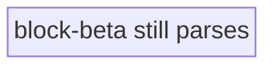

---

## A · Line breaks

### A1 · `<br/>`

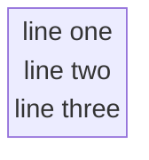

### A2 · `<br>` unclosed

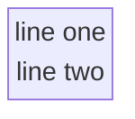

### A3 · Markdown string — backtick-quoted, real newlines

❌ **Confirmed failure.** `Expecting 'STR', got 'MD_STR'` — see *Findings so far*. Left in place
deliberately as the evidence; the broken render below is the point.

```mermaid
block
  columns 1
  a3["`line one
line two`"]
```

### A4 · Literal `\n`


---

## B · Bold

### B1 · Markdown `**` inside a plain quoted string

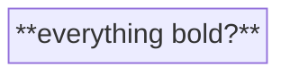

### B2 · Markdown `**` inside a backtick markdown string

```mermaid
block
  columns 1
  b2["`**everything bold?**`"]
```

### B3 · HTML `<b>`

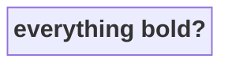

### B4 · HTML `<strong>`


---

## C · Partial bold — the one that matters

If only whole-label bold works, the label design has to change.

### C1 · Markdown, partial, backtick string

```mermaid
block
  columns 1
  c1["`**MailFrom** is bold, this is not`"]
```

### C2 · HTML, partial

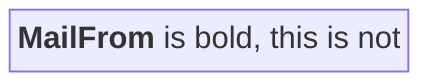

### C3 · Italic and code, partial

```mermaid
block
  columns 1
  c3["`*italic* and normal and **bold**`"]
```

---

## D · Combined — bold plus multiline

The real target: a slice label with a bold title and plain detail beneath.

### D1 · Backtick markdown, newline + bold

```mermaid
block
  columns 1
  d1["`**MailFrom**
reverse_path`"]
```

### D2 · HTML both ways

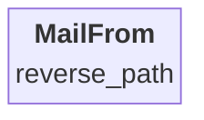

### D3 · Three lines, bold first

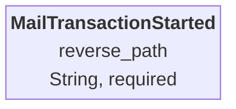

---

## E · A real Command Slice, both ways

Whichever of these looks right wins.

### E1 · HTML labels

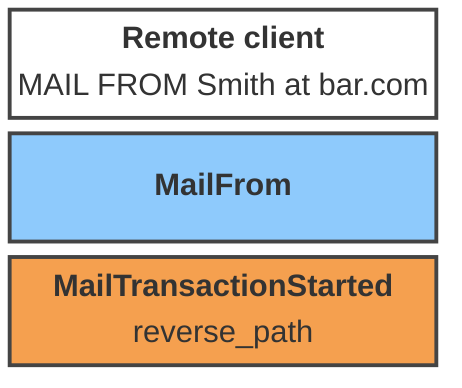

### E2 · Markdown labels

```mermaid
block
  columns 1
  e2a["`**Remote client**
MAIL FROM Smith at bar.com`"]
  e2b["`**MailFrom**`"]
  e2c["`**MailTransactionStarted**
reverse_path`"]

  classDef screen fill:#ffffff,stroke:#444,stroke-width:2px,color:#000
  classDef command fill:#8ecafc,stroke:#444,stroke-width:2px,color:#000
  classDef event fill:#f5a04f,stroke:#444,stroke-width:2px,color:#000
  class e2a screen
  class e2b command
  class e2c event
```

---

## F · Forced width

Long labels may wrap on their own. `columns` plus a spanning block is the documented width lever.

### F1 · Long label, natural wrap

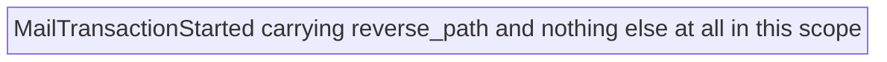

### F2 · Width forced by a wide neighbor

`f2b:3` spans three columns, setting the row width.

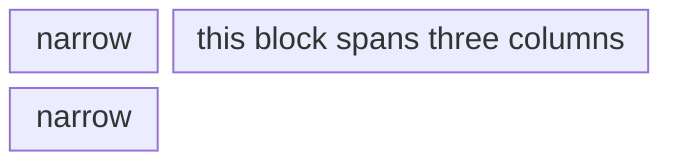
### F3 · Span, corrected

F2 was mis-constructed: `f2a:1` + `f2b:3` is **4 units in a 3-column grid**, so `f2b` took the two
remaining columns and `f2c` wrapped to a second row. The span works; the arithmetic did not.

This version keeps each row's total at 3.

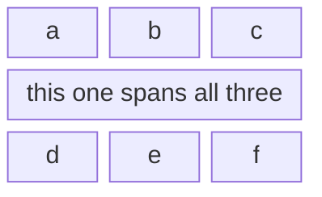

---

## G · Shapes as a color-independent encoding

If color ever fails — printing, color-blind readers, a viewer that strips `classDef` — shape
can carry the element type instead.

```mermaid
block
  columns 3
  g1["Command — rectangle"]
  g2(["Event — stadium"])
  g3[("Read Model — cylinder")]
  g4>"Screen — asymmetric"]
  g5{{"Processor — hexagon"}}
  g6(("Hotspot — circle"))
```

---

## H · Text justification

**The open question**, now that markdown strings are ruled out and HTML is the only route.

Mermaid centres label text by default. A slice label with a bold title over a field list reads far
better left-aligned, so: can it be forced?

### H1 · `text-align` via `style`

Does the node style reach the text, or only the shape?

```mermaid
block
  columns 1
  h1["<b>MailTransactionStarted</b><br/>reverse_path<br/>received_at"]
  style h1 fill:#f5a04f,stroke:#444,stroke-width:2px,color:#000,text-align:left
```

### H2 · `<div align="left">`

```mermaid
block
  columns 1
  h2["<div align='left'><b>MailTransactionStarted</b><br/>reverse_path<br/>received_at</div>"]
  style h2 fill:#f5a04f,stroke:#444,stroke-width:2px,color:#000
```

### H3 · `<div style="text-align:left">`

```mermaid
block
  columns 1
  h3["<div style='text-align:left'><b>MailTransactionStarted</b><br/>reverse_path<br/>received_at</div>"]
  style h3 fill:#f5a04f,stroke:#444,stroke-width:2px,color:#000
```

### H4 · `text-align` via `classDef`

If `style` fails, `classDef` may inject differently.

```mermaid
block
  columns 1
  h4["<b>MailTransactionStarted</b><br/>reverse_path<br/>received_at"]
  classDef leftish fill:#f5a04f,stroke:#444,stroke-width:2px,color:#000,text-align:left
  class h4 leftish
```

### H5 · `<span>` with inline style

Tests whether *any* nested HTML element survives, not just `<b>` and `<br/>`.

```mermaid
block
  columns 1
  h5["<span style='text-align:left;display:block'><b>MailTransactionStarted</b><br/>reverse_path</span>"]
  style h5 fill:#f5a04f,stroke:#444,stroke-width:2px,color:#000
```

### H6 · Padding hack — `&nbsp;`

Works regardless of alignment support: pad the short lines so centring lands them flush left.
Ugly, but it always works if the entities render.

```mermaid
block
  columns 1
  h6["<b>MailTransactionStarted</b><br/>reverse_path&nbsp;&nbsp;&nbsp;&nbsp;&nbsp;&nbsp;&nbsp;&nbsp;&nbsp;<br/>received_at&nbsp;&nbsp;&nbsp;&nbsp;&nbsp;&nbsp;&nbsp;&nbsp;&nbsp;&nbsp;"]
  style h6 fill:#f5a04f,stroke:#444,stroke-width:2px,color:#000
```

### H7 · Leading spaces

Cheapest possible attempt — does the label preserve leading whitespace?

```mermaid
block
  columns 1
  h7["<b>MailTransactionStarted</b><br/>    reverse_path<br/>    received_at"]
  style h7 fill:#f5a04f,stroke:#444,stroke-width:2px,color:#000
```

---

## H8 · Control — does alignment actually *do* anything?

⚠️ **Read this before trusting H1–H7.** A diagram can render perfectly while the alignment
declaration is silently ignored. "Renders ✅" only means *nothing broke*.

This puts an aligned and an unaligned block **side by side with identical text**. If the two look
the same, the alignment did nothing and the ✅ marks in H1–H7 mean only that the syntax was
tolerated.

```mermaid
block
  columns 2
  ctl["<b>UNSTYLED control</b><br/>short<br/>a much longer second line"]
  tst["<b>text-align via style</b><br/>short<br/>a much longer second line"]
  style ctl fill:#eeeeee,stroke:#444,stroke-width:2px,color:#000
  style tst fill:#a8d98a,stroke:#444,stroke-width:2px,color:#000,text-align:left
```

And the same for the wrapper form, which is the likelier winner since it puts the CSS on an
element that actually contains the text:

```mermaid
block
  columns 2
  ctl2["<b>UNSTYLED control</b><br/>short<br/>a much longer second line"]
  tst2["<div style='text-align:left'><b>div wrapper</b><br/>short<br/>a much longer second line</div>"]
  style ctl2 fill:#eeeeee,stroke:#444,stroke-width:2px,color:#000
  style tst2 fill:#a8d98a,stroke:#444,stroke-width:2px,color:#000
```

**What to look for:** in each pair the short line `short` should sit **flush left** in the green
block and **centred** in the grey one. If both are centred, that approach failed.

---

## I · Vertical alignment — can text sit at the top of a tall box?

Follows from **E1**: blocks centre on **both** axes. In a grid of slices with labels of differing
height, nothing shares a baseline — a one-line slice floats in the middle of its row while its
neighbor fills top to bottom. Top-aligning would fix that.

**Prerequisite:** a box is sized by its content, so a "large box" has to come from somewhere. Two
candidates, and the second may not work at all.

### I0 · Baseline — where does text sit by default?

A tall neighbor sets the row height. No styling. This establishes what we are trying to change.

```mermaid
block
  columns 2
  i0tall["<b>tall block</b><br/>line<br/>line<br/>line<br/>line<br/>line"]
  i0short["<b>short</b>"]
  style i0tall fill:#eeeeee,stroke:#444,stroke-width:2px,color:#000
  style i0short fill:#eeeeee,stroke:#444,stroke-width:2px,color:#000
```

**Expect:** `short` sits vertically centred. If it is already at the top, group I is moot.

### I1 · `vertical-align:top` via `style`

```mermaid
block
  columns 2
  i1tall["<b>tall block</b><br/>line<br/>line<br/>line<br/>line<br/>line"]
  i1short["<b>short</b>"]
  style i1tall fill:#eeeeee,stroke:#444,stroke-width:2px,color:#000
  style i1short fill:#a8d98a,stroke:#444,stroke-width:2px,color:#000,vertical-align:top
```

### I2 · `<div style='vertical-align:top'>` wrapper

```mermaid
block
  columns 2
  i2tall["<b>tall block</b><br/>line<br/>line<br/>line<br/>line<br/>line"]
  i2short["<div style='vertical-align:top'><b>short</b></div>"]
  style i2tall fill:#eeeeee,stroke:#444,stroke-width:2px,color:#000
  style i2short fill:#a8d98a,stroke:#444,stroke-width:2px,color:#000
```

### I3 · Wrapper forced to fill the box

If the wrapper fills the height, its content starts at the wrapper's top.

```mermaid
block
  columns 2
  i3tall["<b>tall block</b><br/>line<br/>line<br/>line<br/>line<br/>line"]
  i3short["<div style='height:100%;display:block'><b>short</b></div>"]
  style i3tall fill:#eeeeee,stroke:#444,stroke-width:2px,color:#000
  style i3short fill:#a8d98a,stroke:#444,stroke-width:2px,color:#000
```

### I4 · Flexbox — `align-self` / `align-items`

Labels are often laid out in a flex container. If so, this is the property that actually governs.

```mermaid
block
  columns 2
  i4tall["<b>tall block</b><br/>line<br/>line<br/>line<br/>line<br/>line"]
  i4short["<b>short</b>"]
  style i4tall fill:#eeeeee,stroke:#444,stroke-width:2px,color:#000
  style i4short fill:#a8d98a,stroke:#444,stroke-width:2px,color:#000,align-items:flex-start,align-self:flex-start
```

### I5 · Trailing `<br/>` padding — the guaranteed floor

Pad the bottom so the centred content is pushed to the top. Works regardless of what CSS reaches
the label, exactly like H6 does horizontally. Ugly, and it needs the padding count tuned per row.

```mermaid
block
  columns 2
  i5tall["<b>tall block</b><br/>line<br/>line<br/>line<br/>line<br/>line"]
  i5short["<b>short</b><br/><br/><br/><br/><br/>"]
  style i5tall fill:#eeeeee,stroke:#444,stroke-width:2px,color:#000
  style i5short fill:#a8d98a,stroke:#444,stroke-width:2px,color:#000
```

### I6 · Explicit `height` — can a box be made tall on its own?

No tall neighbor. If this works, box height is controllable directly and I0's premise is not the
only route.

```mermaid
block
  columns 2
  i6a["<b>height forced to 160px?</b>"]
  i6b["<b>unstyled neighbor</b>"]
  style i6a fill:#a8d98a,stroke:#444,stroke-width:2px,color:#000,height:160px
  style i6b fill:#eeeeee,stroke:#444,stroke-width:2px,color:#000
```

**What to look for across I1–I5:** the green block's text should sit **flush with the top** of its
box while the grey neighbor fills the row. If green and grey both centre, that approach did
nothing.

---

## Results

Fill in as observed. This table is the deliverable — `README.md` gets rebuilt from whatever wins.

| Test | What it checks                     | Result | Notes |
|:--:|------------------------------------|:------:|-------|
| A0 | `block-beta` still parses          |   ✅    | Old keyword still accepted — `README.md` wants renaming, not migrating |
| A1 | `<br/>`                            |   ✅    |  |
| A2 | `<br>` unclosed                    |        |  |
| A3 | markdown string newline            |   ❌    | `Parse error … Expecting 'STR', got 'MD_STR'` |
| A4 | literal `\n`                       |   ✅    | **Works** — simpler than `<br/>` where no other markup is needed |
| B1 | `**` plain string                  |   ❌    | Asterisks render literally — markdown not parsed in a plain `STR` |
| B2 | `**` markdown string               |   ❌    | same `MD_STR` cause as A3 |
| B3 | `<b>`                              |   ✅    |  |
| B4 | `<strong>`                         |   ✅    |  |
| C1 | partial bold, markdown             |   ❌    | same `MD_STR` cause as A3 |
| C2 | **partial bold, HTML**             |   ✅    | **Decisive, and it passes.** Label design unblocked |
| C3 | italic + bold mixed                |   ❌    | same `MD_STR` cause as A3 |
| D1 | bold + newline, markdown           |   ❌    | same `MD_STR` cause as A3 |
| D2 | bold + newline, HTML               |   ✅    |  |
| D3 | three lines                        |   ✅    |  |
| E1 | real slice, HTML                   |   ✅    | `MailFrom` sits vertically centred — blocks centre on both axes |
| E2 | real slice, markdown               |   ❌    | same `MD_STR` cause as A3 |
| F1 | natural wrap                       |   ❌    | **No wrapping.** One long line; the box grows arbitrarily wide. Line breaks are mandatory, not optional |
| F2 | forced width via span              |   ⚠️   | Test mis-built — 1+3 in a 3-column grid. Span works; see **F3** |
| F3 | span, corrected                    |        | rows summing to 3 |
| G  | shapes                             |   ✅    |  |
| H1 | `text-align` via `style`           |   ✅ᵣ   |  |
| H2 | `<div align='left'>`               |   ✅ᵣ   |  |
| H3 | `<div style='text-align:left'>`    |   ✅ᵣ   |  |
| H4 | `text-align` via `classDef`        |   ✅ᵣ   |  |
| H5 | `<span>` inline style              |   ✅ᵣ   | **nested HTML survives** — not just `<b>`/`<br/>` |
| H6 | `&nbsp;` padding hack              |   ✅ᵣ   | the guaranteed floor if CSS never reaches the text |
| H7 | leading spaces                     |   ✅ᵣ   |  |
| H8 | **control — aligned vs unaligned** |        | **answers whether H1–H7 actually align** |
| I0 | baseline — default vertical position | | establishes what I1–I5 are changing |
| I1 | `vertical-align:top` via `style` | | |
| I2 | `<div style='vertical-align:top'>` | | |
| I3 | wrapper `height:100%` | | |
| I4 | flex `align-self:flex-start` | | likeliest to be the real lever |
| I5 | trailing `<br/>` padding | | guaranteed floor, needs tuning per row |
| I6 | explicit `height` on `style` | | can a box be made tall without a neighbor? |

**✅ᵣ = rendered without error — *not* confirmation the alignment took effect.** H1–H7 all
parse, but a silently-ignored CSS declaration also parses. **H8 is the control that tells them
apart.** Until it is run, group H is unresolved.
