# Experiment — what block labels can do

Empirical tests of mermaid `block` label formatting, because **the official syntax page documents
none of it.** Searched the Mermaid 11.16.1 *Block Diagram Syntax* page for `markdown`, `<br`,
`newline`, `multiline`, `line break`, `backtick` — **zero hits.** It covers `columns`, widths,
shapes, edges, `style` and `classDef`, and stops there.

So these are the questions, and the only way to answer them is to render and look.

> **Syntax note:** the keyword is **`block`**, not `block-beta`. The beta suffix is gone as of
> 11.16.1. Everything in `README.md` was written against the old form and needs updating if the
> old form has stopped working — test A0 checks exactly that.

**How to use this page:** open it on GitHub, then note which tests render as intended. Anything
that fails will usually show as literal characters in the box, or break the whole diagram.

---

## A0 · Does the old keyword still work?

If this renders, `block-beta` is still accepted as an alias and `README.md` is safe. If it shows
as source, `README.md` needs a sweep.

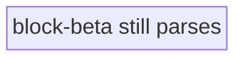

---

## A · Line breaks

### A1 · `<br/>`

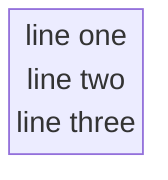

### A2 · `<br>` unclosed

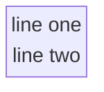

### A3 · Markdown string — backtick-quoted, real newlines

```mermaid
block
  columns 1
  a3["`line one
line two`"]
```

### A4 · Literal `\n`


---

## B · Bold

### B1 · Markdown `**` inside a plain quoted string

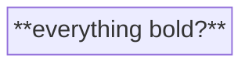

### B2 · Markdown `**` inside a backtick markdown string

```mermaid
block
  columns 1
  b2["`**everything bold?**`"]
```

### B3 · HTML `<b>`

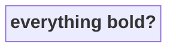

### B4 · HTML `<strong>`


---

## C · Partial bold — the one that matters

If only whole-label bold works, the label design has to change.

### C1 · Markdown, partial, backtick string

```mermaid
block
  columns 1
  c1["`**MailFrom** is bold, this is not`"]
```

### C2 · HTML, partial

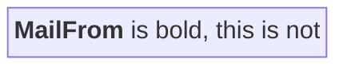

### C3 · Italic and code, partial

```mermaid
block
  columns 1
  c3["`*italic* and normal and **bold**`"]
```

---

## D · Combined — bold plus multiline

The real target: a slice label with a bold title and plain detail beneath.

### D1 · Backtick markdown, newline + bold

```mermaid
block
  columns 1
  d1["`**MailFrom**
reverse_path`"]
```

### D2 · HTML both ways

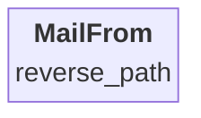

### D3 · Three lines, bold first

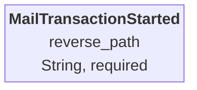

---

## E · A real Command Slice, both ways

Whichever of these looks right wins.

### E1 · HTML labels

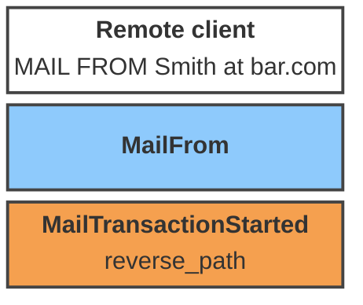

### E2 · Markdown labels

```mermaid
block
  columns 1
  e2a["`**Remote client**
MAIL FROM Smith at bar.com`"]
  e2b["`**MailFrom**`"]
  e2c["`**MailTransactionStarted**
reverse_path`"]

  classDef screen fill:#ffffff,stroke:#444,stroke-width:2px,color:#000
  classDef command fill:#8ecafc,stroke:#444,stroke-width:2px,color:#000
  classDef event fill:#f5a04f,stroke:#444,stroke-width:2px,color:#000
  class e2a screen
  class e2b command
  class e2c event
```

---

## F · Forced width

Long labels may wrap on their own. `columns` plus a spanning block is the documented width lever.

### F1 · Long label, natural wrap

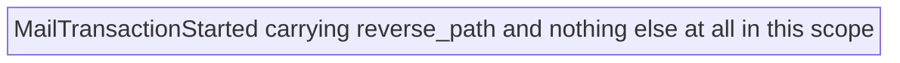

### F2 · Width forced by a wide neighbour

`f2b:3` spans three columns, setting the row width.

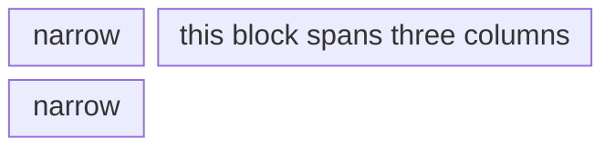

---

## G · Shapes as a color-independent encoding

If color ever fails — printing, color-blind readers, a viewer that strips `classDef` — shape
can carry the element type instead.

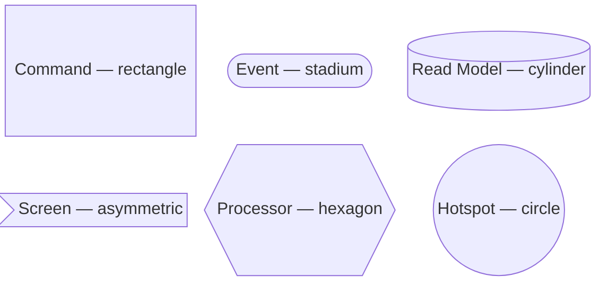

---

## Results

Fill in as observed. This table is the deliverable — `README.md` gets rebuilt from whatever wins.

| Test | What it checks | Renders? | Notes |
|---|---|---|---|
| A0 | `block-beta` still parses | | |
| A1 | `<br/>` | | |
| A2 | `<br>` | | |
| A3 | markdown string newline | | |
| A4 | literal `\n` | | |
| B1 | `**` plain string | | |
| B2 | `**` markdown string | | |
| B3 | `<b>` | | |
| B4 | `<strong>` | | |
| C1 | partial bold, markdown | | |
| C2 | partial bold, HTML | | |
| C3 | italic + bold mixed | | |
| D1 | bold + newline, markdown | | |
| D2 | bold + newline, HTML | | |
| D3 | three lines | | |
| E1 | real slice, HTML | | |
| E2 | real slice, markdown | | |
| F1 | natural wrap | | |
| F2 | forced width via span | | |
| G | shapes | | |
