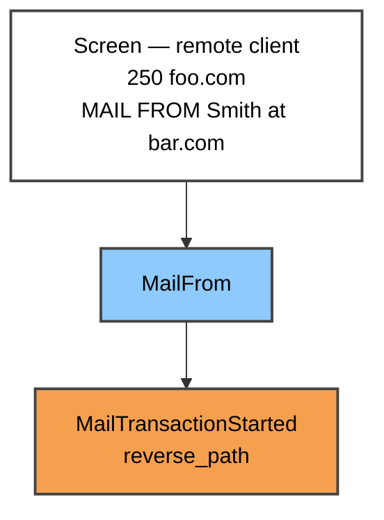
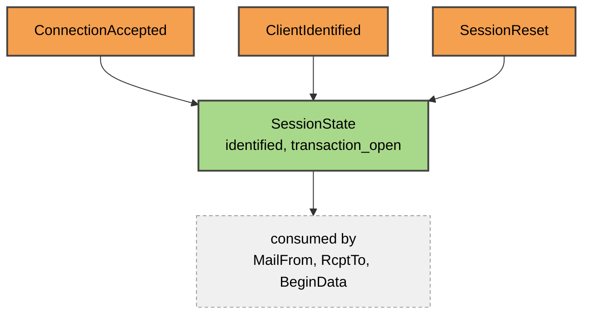
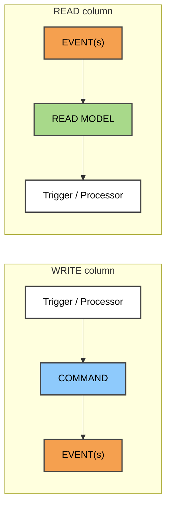
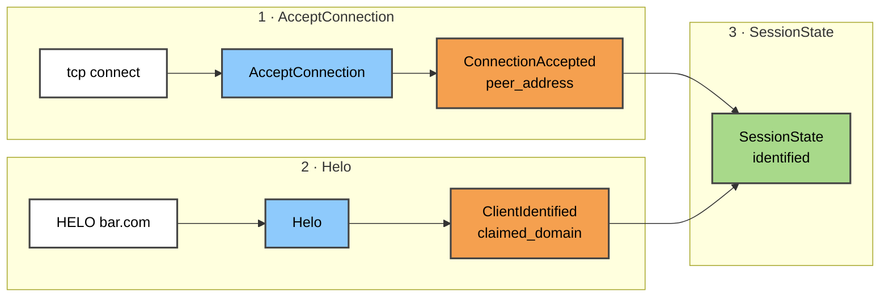
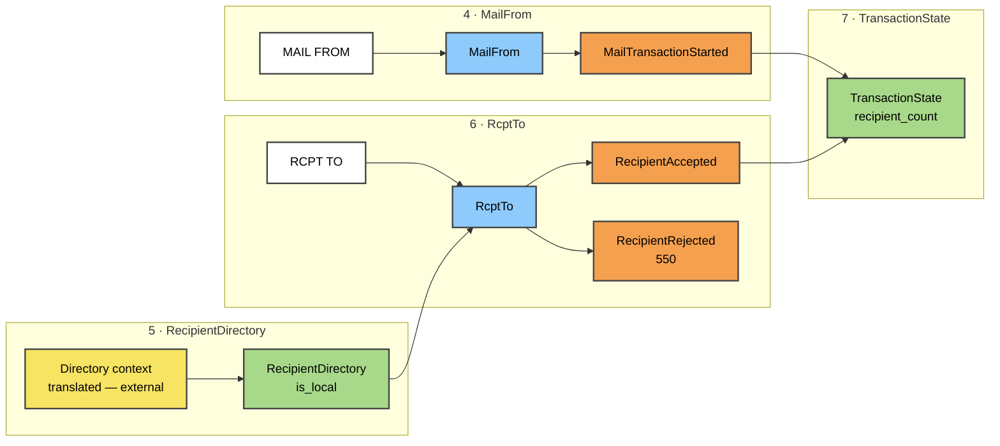
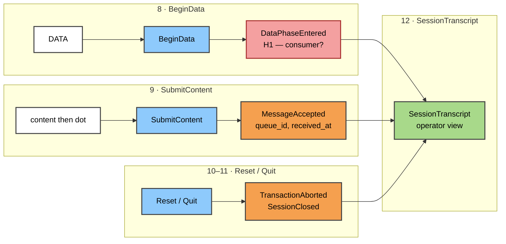
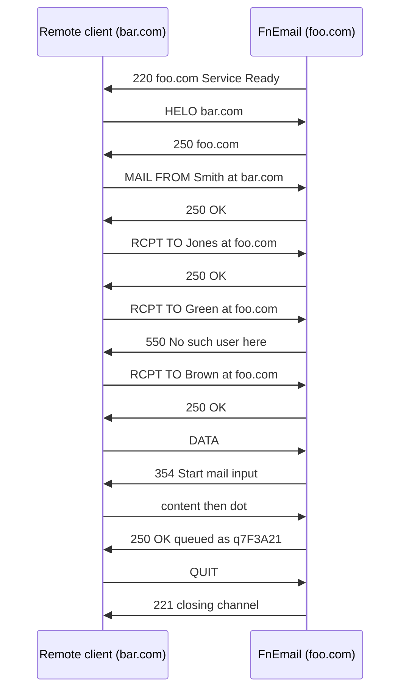

# Diagrams — FnEmail inbound event model

Mermaid renderings of `../event-model.md` v0.3. GitHub renders these inline; the Android app
shows the source, so read this page on GitHub or desktop.

**Colours** — Event **orange** · Command **blue** · Read Model **green** · Screen **white** ·
hotspot **red**. See `../research/UPSTREAM-DEFECTS.md` for the one upstream file that disagrees.

**On the arrows.** Mermaid needs edges to stack nodes; they are a rendering necessity, not Event
Modeling semantics. Meaning is carried by lane position and left-to-right time.

---

## 1. A write column (state change)

One command, one event. This is slice 4, `MailFrom`.

---

## 2. A read column (state view)

Events in, projection out, consumed by whatever sits in that column. This is slice 3,
`SessionState` — note its sources are from **earlier** columns, because a read model is placed at
its consumer, not at its source.

---

## 3. The two column types

The four patterns reduce to these. Automation and Translation are compositions of both.

---

## 4. Inbound timeline — session establishment

Slices 1–3.

---

## 5. Inbound timeline — the transaction

Slices 4–7. `RecipientDirectory` is the Translation boundary onto the Directory context (H3
resolved), so its source is outside this model.

Note `x5` is **yellow** — an external event, which is what distinguishes Translation from
Automation.

---

## 6. Inbound timeline — content and close

Slices 8–12. `DataPhaseEntered` is red: **H1**, an event on trial because its only candidate
consumer is the transcript.

`SessionTranscript` is the **"right chair"** shape — one read model fed by many events. Expected
here; worth watching if it grows.

---

## 7. The first worked path

`../paths/helo-multi-recipient.md`, as a sequence. 13 steps over 11 columns; `RcptTo` walked
three times.

Outcome is **relative to the actor**: complete success for the server, partial for the sender,
failure for `Green`. See the path document for why that matters to the golden-path question.
