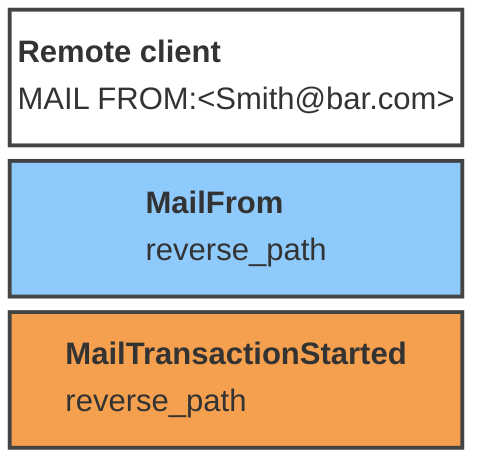
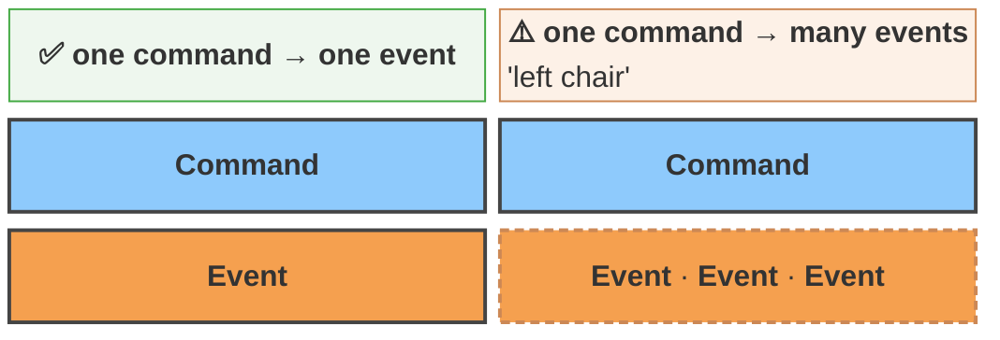
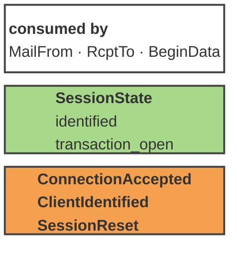
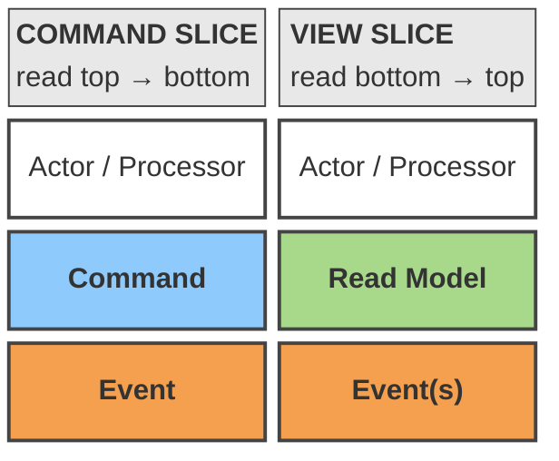
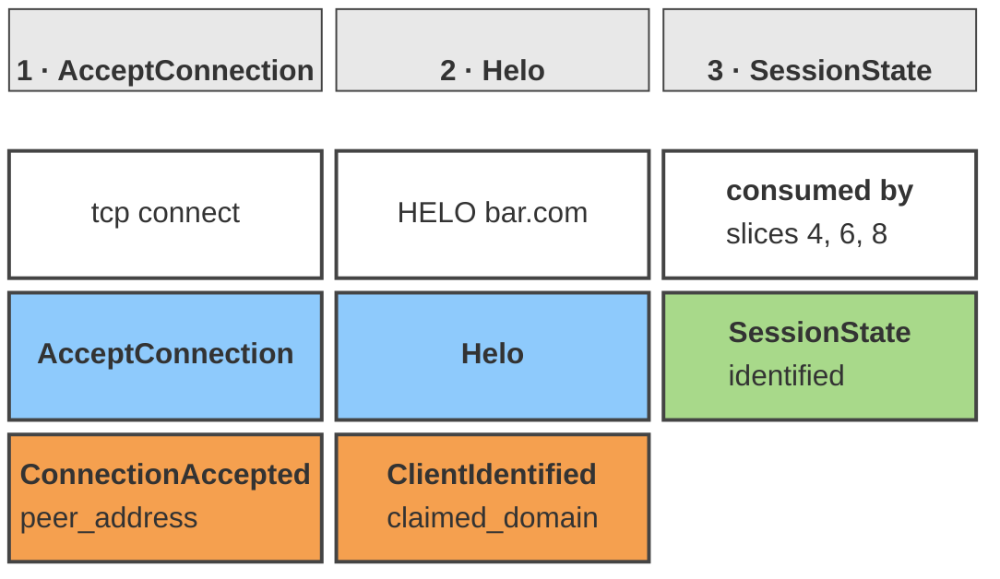
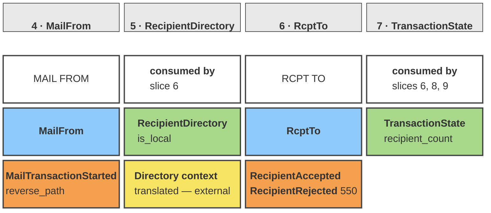
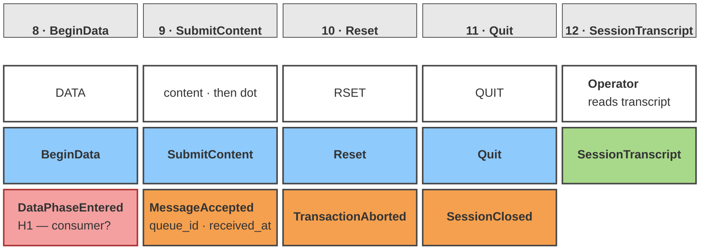
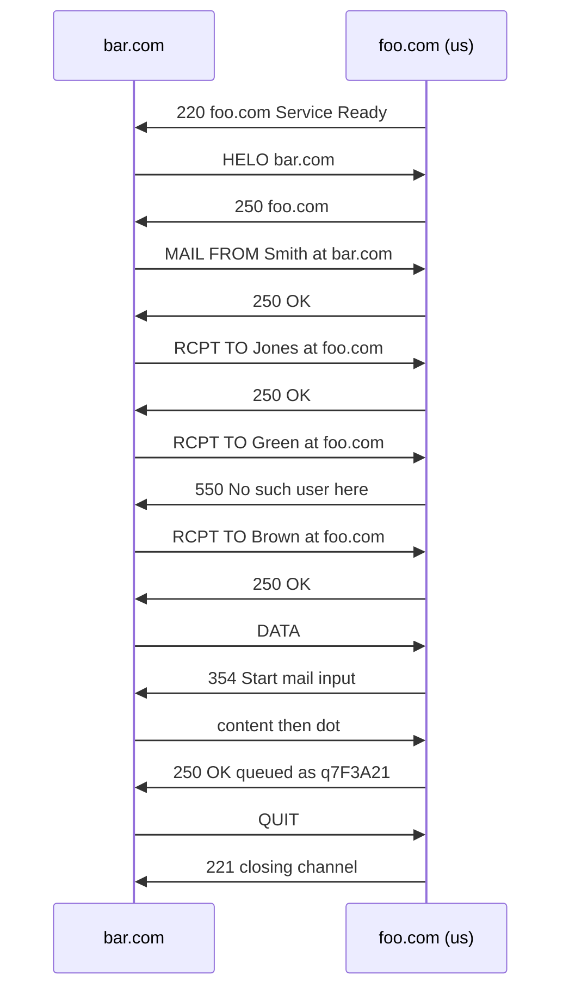
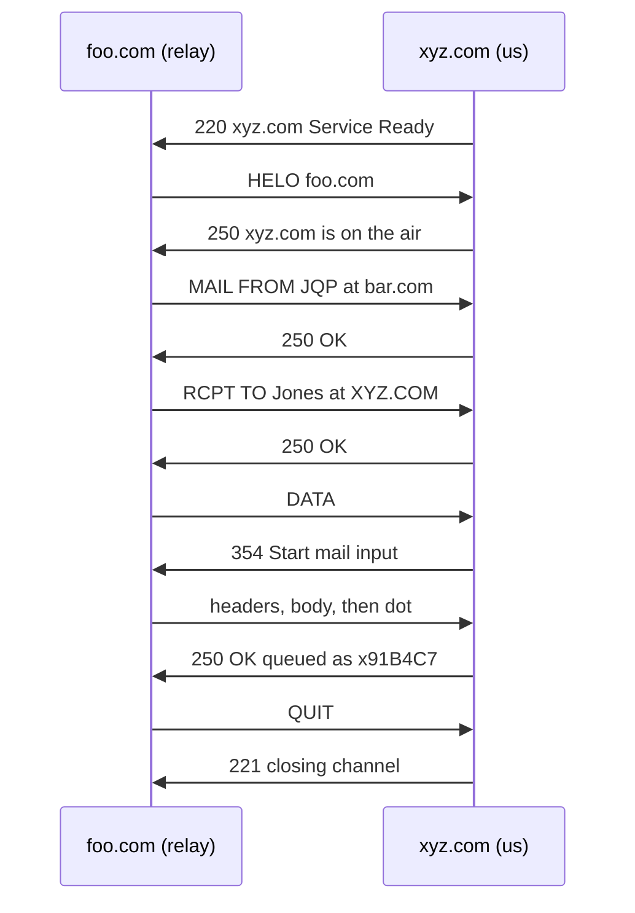

# Diagrams — FnEmail inbound event model

Mermaid renderings of `../event-model.md` v0.3. GitHub renders these inline; the Android app shows
the source, so read this page on GitHub or desktop.

**Colors** — Event **orange** · Command **blue** · Read Model **green** · Screen **white** ·
external **yellow** · hotspot **red**.

**Terminology.** *Slice*, not column — Adam's own word. The two slice types are named here as this
project prefers them, with the corpus synonyms in parentheses:

| This project | Corpus synonyms |
|---|---|
| **Command Slice** | state change · write column · `state-change` |
| **View Slice** | state view · read model · query · `state-view` |

**Rendering vocabulary.** Settled empirically in
[`EXPERIMENT-block-labels.md`](EXPERIMENT-block-labels.md) — the Mermaid docs specify none of it.
One `classDef` per element type carries **color, left alignment and height together**; labels use
`<b>` for the title and `\n` for breaks; markdown never works; boxes never wrap.

**No arrows.** Meaning is carried by row position and left-to-right time. Rows are fixed:

```
row 1   Actor / Screen
row 2   Command (blue)  ·or·  Read Model (green)   ← never both; that is the slice type
row 3   Event (orange)
```

A Command Slice reads **top to bottom**. A View Slice reads **bottom to top**. Same three rows.

---

## 1. Command Slice

*(aka state change, write column)*

Slice 4, `MailFrom`.



### One event per command

**The target is exactly one.** More than one is legal, but it usually signals that several
responsibilities have been folded into a single command, and it should be investigated rather than
accepted.

This is a stronger rule than the corpus states. Dilger names the shape as an anti-pattern —
*"left chair"*, one command to many events — but calls the four anti-patterns *"not red flags, but
something to keep an eye on."* Here it is a design target with a stated reason: **multiple events
usually means multiple responsibility.**

It already earned its keep. In v0.1 `SubmitContent` emitted three event types plus a per-recipient
fan-out. Scoping to inbound removed the fan-out and the completeness check removed a redundant
event, leaving one command, one event — and the model got simpler, not poorer.



**`RcptTo` does not trip this rule.** `RecipientAccepted` and `RecipientRejected` are
*alternatives* — accepted **or** rejected, never both — not a fan-out.

---

## 2. View Slice

*(aka state view, read model, query)*

Slice 3, `SessionState`. Same three rows, read **bottom to top**.



A View Slice may draw on events from **anywhere earlier** on the timeline. It is placed at its
**consumer**, not next to its sources — which is why `SessionState` sits at slice 3 while its
sources are slices 1 and 2.

Many events feeding one read model is the *"right chair"* shape. Expected for a view that
accumulates; worth watching if it grows without a matching growth in the question it answers.

---

## 3. Both slice types, side by side

The shared row structure, and why the two never mix. Row 2 holds a command **or** a read model —
that choice *is* the slice type.



Every slice in the model is one of these two. Automation and Translation are **compositions** — a
View Slice feeding a Command Slice — which is why Dymitruk specifies an automation as *two*
Given-When-Thens rather than one.

---

## 4. Inbound timeline — session establishment

Slices 1–3. Columns are slices; rows are element types; `space` marks a row a slice does not use.



---

## 5. Inbound timeline — the transaction

Slices 4–7. `RecipientDirectory` is the Translation boundary onto the Directory context (H3
resolved), so its source is outside this model — shown **yellow**.



The **yellow** cell is what distinguishes Translation from Automation — the source events belong to
another context.

---

## 6. Inbound timeline — content and close

Slices 8–12. `DataPhaseEntered` is **red**: hotspot **H1**, on trial because its only candidate
consumer is the transcript.



`SessionTranscript` is the **"right chair"** shape — one read model fed by every event above.
Expected here; worth watching if it grows.

---

## 7. Worked paths as sequences

Sequence diagrams, not blocks — a path is a conversation over time, which is what this diagram
type is for.

**Path 1** — [`../paths/helo-multi-recipient.md`](../paths/helo-multi-recipient.md). Three
recipients, one rejected mid-flow. 13 steps over 11 slices.



**Path 2** — [`../paths/helo-single-recipient.md`](../paths/helo-single-recipient.md). One
recipient, no errors. 11 steps over 11 slices.



Outcome is relative to the actor. Path 1 is a complete success for the server, **partial** for the
sender, and a failure for `Green`. Path 2 succeeds for everyone. `Reset` — slice 10 — remains the
only slice no path has touched.
