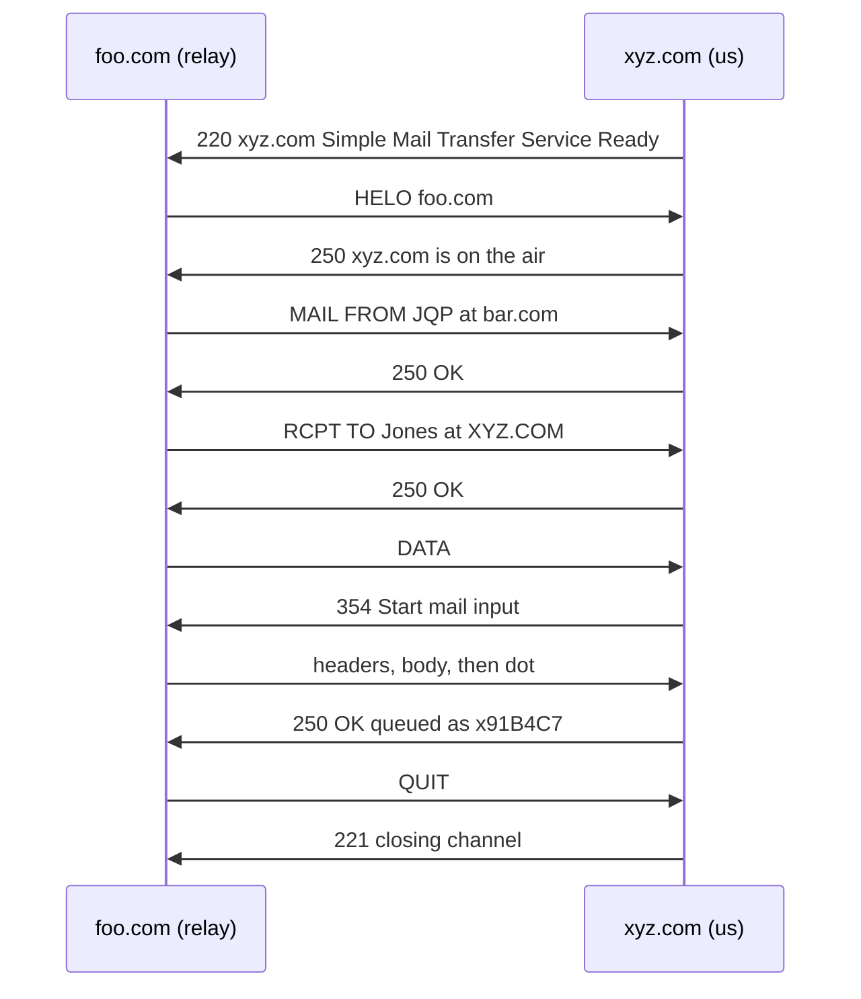

# Path — HELO, single recipient, clean

The simplest complete path through `../event-model.md` v0.3. One `RCPT TO`, no errors, straight
through.

Derived from **RFC 5321 Appendix D.3 step 2** — *Relayed Mail Scenario, relay host to destination
host* — with `HELO` substituted for `EHLO`. Verified against
[`../research/archive/rfc/rfc5321.txt`](../research/archive/rfc/rfc5321.txt).

This is the **cleanest inbound scenario the RFC contains.** It is a candidate for the golden
designation, but **golden is not assigned** — see *Happy is not golden* in
[`helo-multi-recipient.md`](helo-multi-recipient.md).

**The `HELO` substitution is cleaner here than in D.1.** D.3 step 2's greeting reply is a single
line — `250 xyz.com is on the air` — with no extension list, so swapping `EHLO` for `HELO` changes
one word rather than removing a multi-line advertisement.

---

## Scene

| | |
|---|---|
| Server (us) | `xyz.com` at `192.0.2.30:25` |
| Client | `foo.com` at `198.51.100.40` — **a relay**, not the originator |
| Sender | `<JQP@bar.com>` — originated at `bar.com` |
| Recipient | `<Jones@XYZ.COM>` — one, local |
| Time | `Thu, 21 May 1998 05:33:31 -0700` |

**Note the mismatch, deliberately:** the reverse path is `@bar.com` but the connecting client is
`foo.com`. That is ordinary relayed mail, and it is a live check on the model — see *What this
walk tested* below.

---

## The walk

### Step 1 · `AcceptConnection` — C

```
Pre     none  ✓
Wire    S: 220 xyz.com Simple Mail Transfer Service Ready
Post    ConnectionAccepted{ peer_address: "198.51.100.40",
                            local_address: "192.0.2.30:25" }
```

### Step 2 · `Helo` — C

```
Pre     ConnectionAccepted exists  ✓
Wire    C: HELO foo.com
        S: 250 xyz.com is on the air
Post    ClientIdentified{ claimed_domain: "foo.com", protocol: "SMTP" }
```

### Step 3 · `SessionState` — V

```
Sources ConnectionAccepted, ClientIdentified
Post    SessionState{ identified: true, transaction_open: false }
```

### Step 4 · `MailFrom` — C

```
Pre     SessionState.identified = true  ✓
Wire    C: MAIL FROM:<JQP@bar.com>
        S: 250 OK
Post    MailTransactionStarted{ reverse_path: "<JQP@bar.com>" }
```

### Step 5 · `RecipientDirectory` — V  *(translation boundary)*

```
Sources translated events from the Directory context (deferred)
Post    RecipientDirectory{ is_local: true }
```

### Step 6 · `RcptTo` — C  *(once — the whole point of this path)*

```
Pre     MailTransactionStarted ✓ · RecipientDirectory ✓
Wire    C: RCPT TO:<Jones@XYZ.COM>
        S: 250 OK
Post    RecipientAccepted{ forward_path: "<Jones@XYZ.COM>" }
```

### Step 7 · `TransactionState` — V

```
Sources MailTransactionStarted, RecipientAccepted
Post    TransactionState{ open: true,
                          reverse_path: "<JQP@bar.com>",
                          recipient_count: 1 }
```

### Step 8 · `BeginData` — C 🔴 H1

```
Pre     TransactionState.open ✓ · recipient_count >= 1 ✓ (= 1)
Wire    C: DATA
        S: 354 Start mail input; end with <CRLF>.<CRLF>
Post    DataPhaseEntered
```

### Step 9 · `SubmitContent` — C

```
Pre     DataPhaseEntered ✓
Wire    C: Received: from bar.com by foo.com ; Thu, 21 May 1998 05:33:29 -0700
        C: Date: Thu, 21 May 1998 05:33:22 -0700
        C: From: John Q. Public <JQP@bar.com>
        C: Subject: The Next Meeting of the Board
        C: To: Jones@xyz.com
        C: (blank)
        C: Bill: The next meeting of the board of directors will be on Tuesday. John.
        C: .
        S: 250 OK
Post    MessageAccepted{ queue_id: "x91B4C7",
                         reverse_path: "<JQP@bar.com>",
                         recipients: ["<Jones@XYZ.COM>"],
                         content_ref: "blob:sha256:41ad…",
                         actual_octets: 287,
                         received_at: "1998-05-21T05:33:31-07:00" }
```

**The content already carries a `Received:` header** from the previous hop. Ours is prepended at
delivery, not stored on the event — the stored content is what arrived.

### Step 10 · `Quit` — C

```
Pre     ConnectionAccepted exists  ✓
Wire    C: QUIT
        S: 221 xyz.com Service closing transmission channel
Post    SessionClosed{ cause: "quit" }
```

---

## As a sequence



Every reply is 2xx or 3xx. No error branch is taken anywhere.

---

## Accounting

**11 steps over 11 distinct slices** — one step per slice, no repeats.

| | This path | Path 1 | Combined |
|---|---|---|---|
| Steps | 11 | 13 | — |
| `RcptTo` traversals | 1 | 3 | — |
| Slices touched | 11 of 12 | 11 of 12 | **11 of 12** |
| `Reset` | ✗ | ✗ | **still uncovered** |

Two paths, and `Reset` remains the only untouched slice. It needs D.2.

---

## Completeness, instantiated

### Backward — the `Received:` header we prepend

```
Received: from foo.com ([198.51.100.40])
          by xyz.com with SMTP
          id x91B4C7
          for <Jones@XYZ.COM>;
          Thu, 21 May 1998 05:33:31 -0700
```

| Clause | Value | Source |
|---|---|---|
| `FROM` domain | `foo.com` | `ClientIdentified.claimed_domain` |
| address literal | `198.51.100.40` | `ConnectionAccepted.peer_address` |
| `BY` | `xyz.com` | config — H6 |
| `WITH` | `SMTP` | `ClientIdentified.protocol` |
| `ID` | `x91B4C7` | `MessageAccepted.queue_id` |
| **`FOR`** | **`<Jones@XYZ.COM>`** | **`RecipientAccepted.forward_path` — emitted, because exactly one** |
| timestamp | `1998-05-21T05:33:31-07:00` | `MessageAccepted.received_at` |

**The `FOR` clause is the branch path 1 could not reach.** With two recipients it is omitted; with
one it is emitted. Both halves of that rule are now exercised.

---

## What this walk tested

**1. The `FOR` branch — the reason this path exists.** Path 1 omitted it correctly but never
showed it firing. Now both sides are covered.

**2. `reverse_path` domain ≠ `claimed_domain`, and the model does not care.** The sender is
`@bar.com` while the connecting client claims `foo.com`. Nothing in the model relates the two —
they are independent fields on independent events — so relayed mail passes without special
handling. **This is a negative result and it is the valuable kind:** a model that had quietly
assumed they match would break here, and this path proves ours does not.

**3. Received-header stacking.** The arriving content already carries a trace line from the
previous hop. `content_ref` stores what arrived; our header is prepended at delivery. That
separation matters for loop detection (§6.3 counts hops), which is deferred but will need the
stored content to be the unmodified original.

**4. Every actor succeeds.** Unlike path 1:

| Actor | Path 1 | This path |
|---|---|---|
| Server | success | success |
| Sender | **partial** — 2 of 3 | success |
| Recipients | 2 of 3 | success |

Path 1 is *happy for the server, partial for the sender*. This one is happy for everyone, which is
what makes it a stronger candidate for the golden designation — though that remains unassigned.

---

## What it did not test

Nothing new was found. That is worth stating plainly: paths 1 and 2 between them found two payload
defects, one orphan field, and forced H3's resolution — this one found none. A clean path confirms;
it does not discover.

Which is an argument about ordering: **walk the messy path first.** Had this been path 1, the
`MessageAccepted` timestamp defect would still have surfaced, but H3 would have gone unresolved
for longer, since a single-recipient path applies the same pressure at step 5 but is easier to
wave through.

---

## Next paths

| Path | Exercises | Source |
|---|---|---|
| **D.2 — aborted transaction** | `Reset`, the last uncovered slice | RFC, derived |
| **No HELO** | `503` sequencing errors | ours |
| **All recipients rejected** | `BeginData`'s `recipient_count >= 1` failing | ours |
